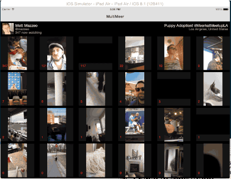

# MultiMeer
Meerkat All The Things



Got bored, messed around with Meerkat. I like it, but wanted to see all the things.  Meerkat FOMO. Now you can watch all the live meerkats at once.

It will update every 5 seconds looking for new streams, and remove old busted streams.

## Help Test!

I have 1000 slots in the Testflight beta.  Find me via email/twitter/whatever, or go to this Google form for access:

http://goo.gl/Xq8lpY

I tested on my iPad Air, and it did seem to work...but haven't done extensive testing. Also, if there are alot of streams, it will use quite a bit of bandwidth. So...yeah. But hey, if you wanna learn about AVFoundation or just hack on some video code, have at it.

```
pod install
```

Then run in XCode.

## Usage

- Tap a cell to listen to just that stream & see details on broadcaster, tap again to listen to everything
- Tap action icon in nav bar to view the stream in the Meerkat app

## TODO

-  Tracking all enhancements/bugs in issues

## Release Notes

###  v1.0.0 (18)
-  First App Store submission
-  Limited to 1 stream when using cellular connection
-  Can tap any stream to force play

###  v1.0.0 (12)
-  Fixed annoying mute/solo audio issue

###  v1.0.0 (11)
-  Fixed lots of bugs when reordering cells

###  v1.0.0 (8)
-  Fixed stupid audio bug (was testing late at night without sound, ha)

###  v1.0.0 (6)
-  Loads cover image while buffering stream
-  Limits # of streams to play (configurable in system settings, 10 as default)

###  v1.0.0 (4)
-  Added scheme support for jumping to Meerkat app from MultiMeer

###  v1.0.0 (3)
-  Initial public beta

## Contact

PJ Gray

- http://github.com/pj4533
- http://twitter.com/pj4533
- pj@pj4533.com
